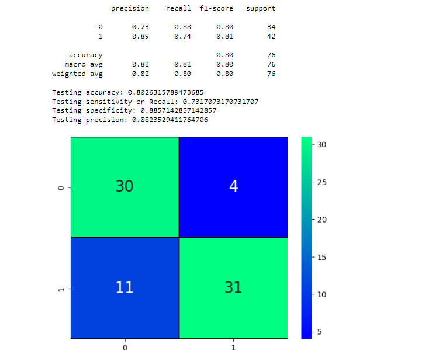

# Heart-Disease-Prediction
A project on heart disease prediction. 

<b>Heart Disease Prediction Project Analysis</b>

Introduction
The heart disease prediction project aims to create a model that accurately predicts the presence of heart disease based on various health indicators.
The dataset used includes 303 instances with 14 attributes, including demographic, lifestyle, and health-related information.
 
 
Dataset Overview
The dataset contains the following features:
- `age`: Age of the patient
- `sex`: Sex of the patient (1 = male; 0 = female)
- `cp`: Chest pain type (0-3)
- `trestbps`: Resting blood pressure (mm Hg)
- `chol`: Serum cholesterol (mg/dl)
- `fbs`: Fasting blood sugar (> 120 mg/dl, 1 = true; 0 = false)
- `restecg`: Resting electrocardiographic results (0-2)
- `thalach`: Maximum heart rate achieved
- `exang`: Exercise-induced angina (1 = yes; 0 = no)
- `oldpeak`: ST depression induced by exercise relative to rest
- `slope`: Slope of the peak exercise ST segment (0-2)
- `ca`: Number of major vessels colored by fluoroscopy (0-3)
- `thal`: Thalassemia (1 = normal; 2 = fixed defect; 3 = reversible defect)
- `target`: Presence of heart disease (1 = yes; 0 = no)
 
 
 
 <figure>
  <figcaption><b><i> Distribution Curve after Minmax Scaling </i></b></figcaption> 
    
  
</figure>
 
 
Data Preprocessing and Exploration
The dataset was first loaded and inspected for any missing values or anomalies. No missing values were found. 
 
 
 
Next, a heatmap was generated to visualize the correlation between features.

This heatmap revealed significant correlations:
- High positive correlation between `cp` (chest pain type) and `target`.
- Negative correlation between `exang` (exercise-induced angina) and `target`.

Data Distribution
The histograms for each feature showed their distributions, aiding in understanding their impact on heart disease.

Model Building and Evaluation
The dataset was split into training (75%) and testing (25%) sets.

A Decision Tree Classifier was chosen for its simplicity and interpretability. 
The model was trained and evaluated using 10-fold cross-validation, 
achieving an average accuracy of approximately 80%.

The model's performance was further assessed using a confusion matrix and classification report.

Key metrics included:
- Accuracy: 80%
- Recall (Sensitivity): 80%
- Precision: 83%
- Specificity: 76%
 
 
 <figure>
  <figcaption><b><i> Distribution Curve after Minmax Scaling </i></b></figcaption> 
    
  
</figure>
 
 

  

Prediction :
The model was tested with example inputs, demonstrating its capability to predict heart disease presence.

Significant Findings
1. Correlation Insights:
   - Chest pain type (`cp`) is a significant predictor of heart disease.
   - Exercise-induced angina (`exang`) negatively correlates with heart disease presence.
   
2. Model Performance:
   - The Decision Tree Classifier demonstrated solid performance with an accuracy of 80%.
   - High precision and recall indicate the model's reliability in predicting heart disease.

Future Prospects
1. Model Enhancement:
   - Implement ensemble methods like Random Forest or Gradient Boosting to potentially improve accuracy and robustness.
   - Use hyperparameter tuning techniques like GridSearchCV to optimize model performance.

2. Feature Engineering:
   - Explore the creation of new features from existing data to capture more nuanced patterns.
